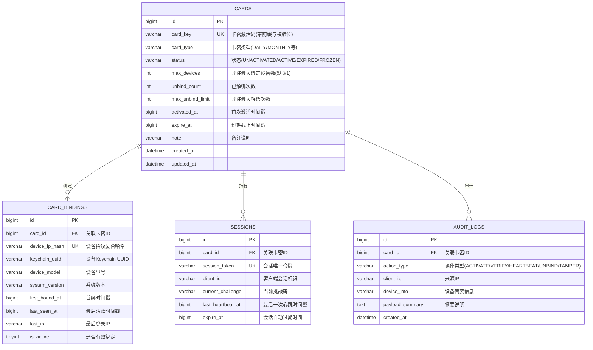

# iOS 网络验证通信协议规格书与接口数据字典

- **文档版本**：v1.0.0
- **适用系统**：iOS 14.0+ (Dylib 客户端) / Auth Server API v1
- **文档状态**：Draft / Architectural Specification
- **更新日期**：2026-10-04

---

## 1. 协议概述与安全传输模型

为了抵御中间人攻击 (MITM)、离线抓包重放、接口批量暴力探测以及内存伪造，通信协议在 HTTPS 传输层之上引入了**应用层双向混合加密与动态防重放机制**。

### 1.1 分层安全架构

```
┌────────────────────────────────────────────────────────┐
│                   业务负载数据 (JSON)                  │
├────────────────────────────────────────────────────────┤
│          应用层对称加密 (AES-256-GCM 密文 + Tag)        │
├────────────────────────────────────────────────────────┤
│ 报文头防重放与签名 (Nonce + Timestamp + HMAC-SHA256)   │
├────────────────────────────────────────────────────────┤
│             传输层安全 (TLS 1.3 / SSL Pinning)         │
└────────────────────────────────────────────────────────┘
```

### 1.2 密钥协商与会话生命周期
1. **客户端出厂公钥**：Dylib 内部内嵌服务端公钥证书指纹及 RSA-2048 / ECC-P256 公钥。
2. **动态握手协商**：客户端首次启动调用握手接口，生成本端随机 32 字节会话密钥（`SessionKey`），通过非对称加密传输至服务端。
3. **请求签名算法**：
   $$\text{Signature} = \text{HMAC-SHA256}(\text{SignKey}, \text{Timestamp} + "\&" + \text{Nonce} + "\&" + \text{CipherBody})$$
4. **防重放窗口**：
   - 服务端校验 $|\text{ServerTime} - \text{Timestamp}| \le 30000 \text{ ms}$。
   - 服务端在 Redis 中保存 `nonce:<value>`，设置 60 秒原子过期。若 Key 已存在，立即拒绝请求（4001 Replay Attack）。

---

## 2. 通用报文结构规范

### 2.1 HTTP 通用请求头 (Request Headers)

| 标头字段 (Header) | 类型 | 必填 | 示例值 | 说明 |
| :--- | :--- | :--- | :--- | :--- |
| `Content-Type` | String | 是 | `application/json` | 固定 JSON 类型 |
| `X-Auth-Version` | String | 是 | `1.0.0` | 客户端协议规范版本 |
| `X-Auth-Timestamp` | Int64 | 是 | `1791100800000` | 客户端 Unix 毫秒级时间戳 |
| `X-Auth-Nonce` | String | 是 | `8f4b5a2e1d0c43a7` | 16~32 位十六进制随机字符串 |
| `X-Auth-Client-ID` | String | 是 | `cli_7a8b9c0d` | 会话凭证 ID 或临时会话标识符 |
| `X-Auth-Signature` | String | 是 | `e3b0c44298fc1c14...` | HMAC-SHA256 签名十六进制小写串 |

### 2.2 请求报文外壳 (Request Envelope)

所有向服务端发送的 POST 请求均统一封装为如下外壳格式：

```json
{
  "client_id": "cli_7a8b9c0d",
  "iv": "4f9b2d8a1c7e3f5b8a0c2d4e",
  "auth_tag": "9a8b7c6d5e4f3a2b1c0d9e8f7a6b5c4d",
  "cipher_data": "BASE64_ENCODED_AES_GCM_CIPHERTEXT"
}
```

- `iv`：12 字节 GCM 初始化向量 (Hex 编码，共 24 字符)。
- `auth_tag`：16 字节 GCM 消息认证标签 (Hex 编码，共 32 字符)。
- `cipher_data`：AES-256-GCM 加密后的实际业务 JSON 字符串，经 Base64 编码。

### 2.3 统一响应报文外壳 (Response Envelope)

服务端响应无论成功或失败，HTTP 状态码通常保持 `200 OK`（网络基础设施错误除外），业务层通过统一结构返回：

```json
{
  "code": 0,
  "msg": "success",
  "timestamp": 1791100800120,
  "nonce": "server_nonce_32char_hex",
  "iv": "1a2b3c4d5e6f7a8b9c0d1e2f",
  "auth_tag": "8a7b6c5d4e3f2a1b0c9d8e7f6a5b4c3d",
  "data": "BASE64_ENCODED_AES_GCM_CIPHERTEXT"
}
```

- 若 `code != 0`，则 `data` 可为空字符串，`msg` 提供错误提示文本。

---

## 3. 核心 API 接口契约详述

以下业务请求与响应体均指**解密后的明文 JSON 结构**。

### 3.1 初始握手与时钟校准 (`POST /api/v1/auth/handshake`)

- **功能**：建立客户端与服务端的初始加密会话信道，校准客户端时钟，下发服务端临时会话票据。
- **频控策略**：单 IP / 10 秒内不超过 5 次。

#### 请求体明文数据 (Plaintext Request Body)
```json
{
  "app_bundle_id": "com.target.application",
  "client_sdk_version": "1.0.0",
  "ephemeral_public_key": "MIIBIjANBgkqhkiG9w0BAQEFAAOCAQ8AMIIBCgKCAQEA...",
  "encrypted_session_key": "HEX_OR_BASE64_ENCRYPTED_KEY_BY_SERVER_RSA_PUBKEY"
}
```

| 字段 | 类型 | 必填 | 说明 |
| :--- | :--- | :--- | :--- |
| `app_bundle_id` | String | 是 | 宿主 App 的 Bundle Identifier |
| `client_sdk_version` | String | 是 | Dylib 注入模块自身版本号 |
| `ephemeral_public_key` | String | 否 | 客户端临时 ECDH 公钥（若采用 ECC 模式） |
| `encrypted_session_key` | String | 是 | 经服务端内置 RSA 公钥加密后的随机 32 字节 AES 密钥 |

#### 响应体明文数据 (`data` 字段解密后)
```json
{
  "client_id": "cli_7a8b9c0d99ef12",
  "server_timestamp": 1791100800150,
  "heartbeat_interval_sec": 60,
  "sign_salt": "dynamic_sign_salt_32char_hex"
}
```

| 字段 | 类型 | 说明 |
| :--- | :--- | :--- |
| `client_id` | String | 分配给该客户端的本次会话标识符，后续放入 Header |
| `server_timestamp` | Int64 | 服务端精准当前 Unix 毫秒时间戳，用于客户端纠偏 |
| `heartbeat_interval_sec` | Int32 | 推荐心跳间隔时间（秒），默认 60 秒 |
| `sign_salt` | String | 参与后续请求签名的动态盐值 |

---

### 3.2 卡密激活绑定 (`POST /api/v1/auth/activate`)

- **功能**：用户在注入弹窗输入卡密，向服务端发起首次绑定激活请求。

#### 请求体明文数据 (Plaintext Request Body)
```json
{
  "card_key": "PRO-YEAR-9921-AF38-88CC",
  "device_fingerprint": {
    "keychain_uuid": "A8B7C6D5-E4F3-4A2B-8C1D-0E9F8A7B6C5D",
    "idfv": "E621E1F8-C36C-495A-93FC-0C247A3E6E5F",
    "device_model": "iPhone14,2",
    "system_version": "16.5",
    "bundle_id": "com.target.application",
    "hardware_hash": "e3b0c44298fc1c149afbf4c8996fb92427ae41e4649b934ca495991b7852b855"
  }
}
```

#### 响应体明文数据 (`data` 字段解密后)
```json
{
  "card_key": "PRO-YEAR-9921-AF38-88CC",
  "card_type": "ANNUAL",
  "status": "ACTIVE",
  "activated_at": 1791100800,
  "expire_at": 1822636800,
  "session_token": "sess_88cc9921_af38_44e1_bb90_123456789abc",
  "challenge_token": "chall_init_16char_hex",
  "max_devices": 1,
  "bound_devices_count": 1
}
```

| 字段 | 类型 | 说明 |
| :--- | :--- | :--- |
| `card_type` | String | 卡密类别：`HOURLY` / `DAILY` / `WEEKLY` / `MONTHLY` / `ANNUAL` / `LIFETIME` |
| `status` | String | 卡密状态：`ACTIVE` |
| `activated_at` | Int64 | 激活时间戳 (秒) |
| `expire_at` | Int64 | 过期时间戳 (秒)，永久卡可约定为 `0` 或极大值 |
| `session_token` | String | 鉴权授权 Token，持久化保存于 Keychain 中以便下次免密登录 |
| `challenge_token` | String | 首次心跳验证的滚动挑战码 (Challenge Token) |

---

### 3.3 凭证验证登录 (`POST /api/v1/auth/verify`)

- **功能**：客户端冷启动时，如检测到本地 Keychain 存有 `card_key` 或 `session_token`，自动静默向服务器验证。如通过则直接放行，无需弹出输入卡密框。

#### 请求体明文数据 (Plaintext Request Body)
```json
{
  "card_key": "PRO-YEAR-9921-AF38-88CC",
  "session_token": "sess_88cc9921_af38_44e1_bb90_123456789abc",
  "device_fingerprint": {
    "keychain_uuid": "A8B7C6D5-E4F3-4A2B-8C1D-0E9F8A7B6C5D",
    "idfv": "E621E1F8-C36C-495A-93FC-0C247A3E6E5F",
    "hardware_hash": "e3b0c44298fc1c149afbf4c8996fb92427ae41e4649b934ca495991b7852b855"
  }
}
```

#### 响应体明文数据 (`data` 字段解密后)
```json
{
  "valid": true,
  "expire_at": 1822636800,
  "remaining_seconds": 31536000,
  "challenge_token": "chall_next_16char_hex",
  "announcement": {
    "id": 102,
    "title": "系统运行正常",
    "content": "欢迎使用授权模块",
    "force_alert": false
  }
}
```

---

### 3.4 动态心跳续租 (`POST /api/v1/auth/heartbeat`)

- **功能**：应用运行期间周期性上报，采用“**滚动挑战-应答 (Challenge-Response)**”模式，防止网络抓包伪造心跳或单纯本地打桩。

#### 请求体明文数据 (Plaintext Request Body)
```json
{
  "session_token": "sess_88cc9921_af38_44e1_bb90_123456789abc",
  "challenge_response": "SHA256(challenge_token + sign_salt + timestamp)",
  "uptime_sec": 300,
  "tamper_status": {
    "is_jailbroken": false,
    "is_debugged": false
  }
}
```

| 字段 | 类型 | 必填 | 说明 |
| :--- | :--- | :--- | :--- |
| `session_token` | String | 是 | 激活后签发的当前有效会话令牌 |
| `challenge_response` | String | 是 | 对上一轮挑战码、动态盐与当前时间戳计算的哈希值 |
| `uptime_sec` | Int32 | 是 | 注入 Dylib 在宿主中连续存活秒数 |
| `tamper_status` | Object | 是 | 客户端环境安全自检摘要 |

#### 响应体明文数据 (`data` 字段解密后)
```json
{
  "alive": true,
  "next_challenge_token": "chall_new_cycle_88aa",
  "expire_at": 1822636800,
  "force_action": "NONE"
}
```

| 字段 | 类型 | 说明 |
| :--- | :--- | :--- |
| `alive` | Boolean | 心跳续租是否成功 |
| `next_challenge_token` | String | 下一次心跳必须携带的挑战凭据（一次一密滚动更新） |
| `force_action` | String | 服务端主动指令：`NONE` (无操作) / `FORCE_LOGOUT` (强制踢出) / `TERMINATE` (异常熔断闪退) |

---

### 3.5 设备解绑换绑 (`POST /api/v1/auth/unbind`)

- **功能**：用户在更换设备时申请将卡密与原设备指纹解绑。

#### 请求体明文数据 (Plaintext Request Body)
```json
{
  "card_key": "PRO-YEAR-9921-AF38-88CC",
  "session_token": "sess_88cc9921_af38_44e1_bb90_123456789abc",
  "device_fingerprint": {
    "keychain_uuid": "A8B7C6D5-E4F3-4A2B-8C1D-0E9F8A7B6C5D"
  },
  "reason": "USER_CHANGE_DEVICE"
}
```

#### 响应体明文数据 (`data` 字段解密后)
```json
{
  "unbind_success": true,
  "unbind_count_used": 1,
  "unbind_count_limit": 3,
  "deducted_hours": 2,
  "new_expire_at": 1822629600
}
```

| 字段 | 类型 | 说明 |
| :--- | :--- | :--- |
| `unbind_success` | Boolean | 解绑是否成功 |
| `unbind_count_used` | Int32 | 当前周期内已换绑次数 |
| `unbind_count_limit` | Int32 | 该卡密允许的最大换绑次数 |
| `deducted_hours` | Int32 | 根据换绑策略扣除的惩罚有效时长（小时） |
| `new_expire_at` | Int64 | 扣除时长后的最新到期时间戳 |

---

## 4. 接口数据字典

### 4.1 全局错误码字典 (Error Code Specification)

| 状态码 (`code`) | 英文标识 | 描述信息与处理建议 |
| :--- | :--- | :--- |
| `0` | `SUCCESS` | 请求处理成功 |
| `4000` | `INVALID_PARAMS` | 请求参数缺失或格式不合法 |
| `4001` | `REPLAY_ATTACK_DETECTED` | 命中了防重放 Nonce 缓存或时间偏差大于阈值 |
| `4002` | `SIGNATURE_VERIFY_FAILED` | 请求 HMAC-SHA256 签名校验失败 |
| `4003` | `DECRYPT_PAYLOAD_FAILED` | 密文解密失败 (AES-GCM AuthTag 校验失败) |
| `4004` | `SESSION_EXPIRED` | 会话凭据失效，需重新激活或登录 |
| `4010` | `CARD_NOT_FOUND` | 卡密不存在，提示用户检查拼写 |
| `4011` | `CARD_ALREADY_EXPIRED` | 卡密已超过有效期 |
| `4012` | `CARD_FROZEN` | 卡密已被管理员冻结/封禁 |
| `4013` | `DEVICE_LIMIT_EXCEEDED` | 绑定的设备数已达上限，需解绑后重试 |
| `4014` | `DEVICE_MISMATCH` | 当前设备与绑定的设备指纹不匹配 |
| `4015` | `UNBIND_LIMIT_EXCEEDED` | 解绑换绑次数超限，拒绝换绑 |
| `4016` | `CHALLENGE_MISMATCH` | 心跳滚动挑战码核验失败，怀疑存在内存打桩 |
| `4020` | `APP_BUNDLE_BLOCKED` | 该宿主 App Bundle ID 未获授权接入 |
| `4030` | `SECURITY_TAMPER_ALERT` | 客户端上报逆向/调试/Hook 风险，服务端终止授权 |
| `5000` | `INTERNAL_SERVER_ERROR` | 验证服务端内部错误 |

---

### 4.2 卡密类型与枚举定义

#### 4.2.1 卡密时长类型 (`CardType`)
| 枚举值 | 描述 | 有效期换算规则 |
| :--- | :--- | :--- |
| `HOURLY` | 小时卡 | 首次激活时间 + $N \times 3600$ 秒 |
| `DAILY` | 天卡 | 首次激活时间 + $1 \times 86400$ 秒 |
| `WEEKLY` | 周卡 | 首次激活时间 + $7 \times 86400$ 秒 |
| `MONTHLY` | 月卡 | 首次激活时间 + $30 \times 86400$ 秒 |
| `ANNUAL` | 年卡 | 首次激活时间 + $365 \times 86400$ 秒 |
| `LIFETIME` | 永久卡 | 无过期时间（标记 `expire_at = 0`） |

#### 4.2.2 卡密生命周期状态 (`CardStatus`)
```
[未激活 UNACTIVATED] ──(首次绑定激活)──> [正常使用 ACTIVE] ──(到达截止时间)──> [已过期 EXPIRED]
          │                                  │
          │ (管理员手动封禁)                   │ (解绑换绑)
          ▼                                  ▼
    [已冻结 FROZEN]                    [待换绑 UNBOUND]
```

---

### 4.3 设备指纹模型字典 (`DeviceFingerprint`)

设备指纹采用多因子加权设计，兼顾 iOS 严格沙盒限制与防重装重置能力：

| 字段名称 | 类型 | 取值机制 | 持久化方式 | 抗重装能力 |
| :--- | :--- | :--- | :--- | :--- |
| `keychain_uuid` | String | 首次运行通过 `UUID.uuidString` 生成的全局唯一字符串 | 存储于 iOS Keychain (`kSecAttrAccessibleAfterFirstUnlock`) | **极强** (应用卸载重装仍保持不变) |
| `idfv` | String | `UIDevice.current.identifierForVendor.uuidString` | 内存采集 | 强 (相同开发者账号下应用共享) |
| `device_model` | String | `utsname.machine` (如 `iPhone14,2`) | 内存采集 | 强 (硬件真实属性) |
| `system_version`| String | `UIDevice.current.systemVersion` (如 `16.5`) | 内存采集 | 中 (系统 OTA 升级会变更) |
| `hardware_hash` | String | 屏幕物理尺寸 + 核心数 + 设备内存总量 + 硬件盐的 SHA256 摘要 | 动态计算 | **强** (阻断常见模拟器/沙盒篡改) |

---

### 4.4 数据库核心实体关系规划 (Schema Blueprint)



---

## 5. 防护与对抗实施规约

1. **客户端通信防护**：
   - 密钥与动态盐值禁止在内存中长久明文驻留，使用后立即使用 `memset_s` 清除。
   - 网络接口必须启用严格的证书链校验或公钥证书哈希固定 (SSL/TLS Pinning)，防止 Charles / Fiddler / mitmproxy 注入中间人证书劫持。
2. **服务端风控防刷**：
   - 握手接口限制单 IP 突发频次；
   - 激活接口引入连错 5 次临时锁定 IP 机制（防暴力碰撞卡密）；
   - Redis 中对 `session_token` 设置双重心跳租约（如心跳周期为 60 秒，Redis TTL 设置为 180 秒，连续 3 次漏心跳自动判定离线并释放资源）。
