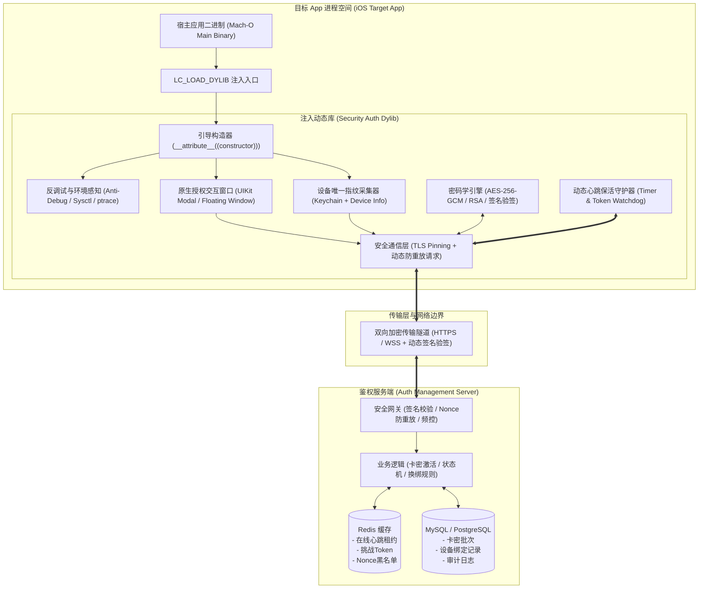
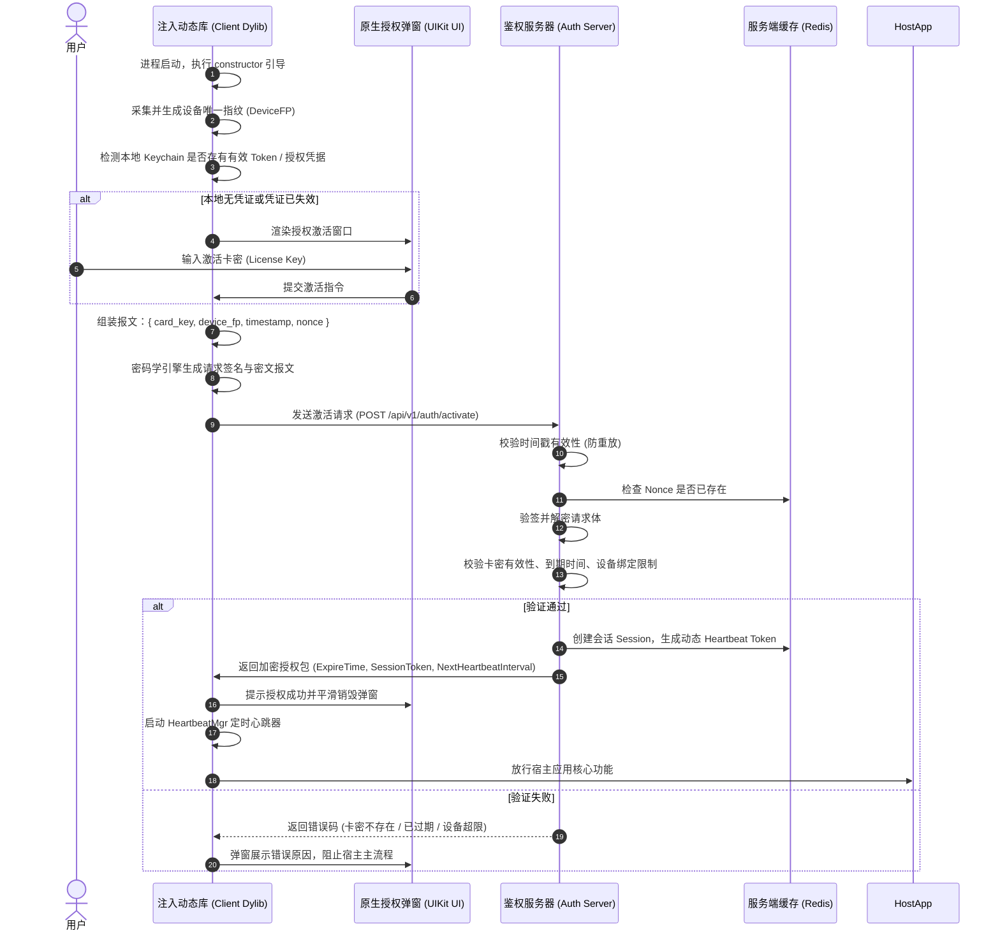
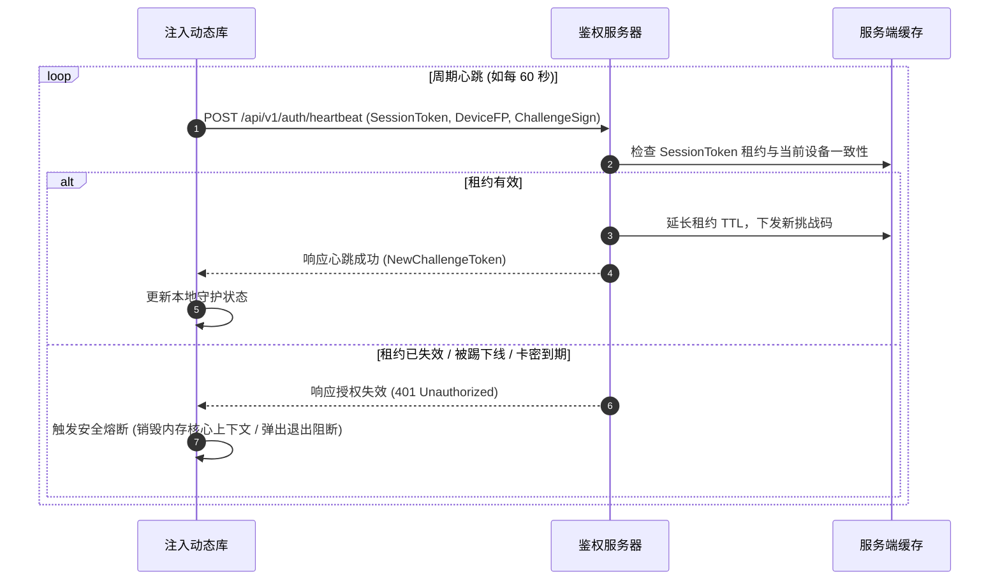

# iOS 网络验证与 Dylib 注入框架

[](https://developer.apple.com/ios/)
[]()
[]()

---

## 1. 项目简介

本方案是一套面向 iOS 平台的**高安全级动态库注入式网络授权验证系统**。系统通过向目标 Mach-O 可执行文件注入动态链接库（Dylib），在应用启动阶段拉起授权窗口，利用端到端加密通信协议与鉴权服务器进行设备指纹核验、卡密激活及动态心跳保活。

支持在**越狱设备**（Theos / Tweak 模式）与**非越狱设备**（IPA 重签名 / 侧载注入）下稳定运行。

---

## 2. 系统整体架构

系统主要划分为三大子系统：**目标应用与注入 Dylib 客户端**、**安全传输隧道**、**验证与授权管理后端**。



---

## 3. 核心业务流程时序

### 3.1 激活与登录授权时序



### 3.2 动态心跳保活与异常熔断机制



---

## 4. 关键技术方案设计

### 4.1 客户端 Dylib 架构设计
- **入口引导机制**：采用 Mach-O `__attribute__((constructor))` 引导机制优先于主程序入口点执行。
- **设备指纹采集**：
  - 核心标识由系统通用唯一标识与 Keychain 持久化数据融合构成。
  - 即使宿主应用被卸载重装，仍能在同设备上还原同一指纹，防止刷试用卡密。
- **UI 呈现与隔离**：
  - 构建独立的 `UIWindow` 浮层，拥有独立的 `UIWindowLevel`（如 `UIWindowLevelAlert + 100`）。
  - 不依赖目标 App 现有的 ViewController 层次结构，保证在任何第三方宿主内均能稳定呈现。

### 4.2 注入与重签名方案
1. **未越狱 IPA 侧载**：
   - 提取 IPA 中的主二进制文件。
   - 使用 `optool` 执行：`optool install -c load -p @executable_path/Frameworks/SecurityAuth.dylib -t Payload/TargetApp.app/TargetApp`。
   - 将 `SecurityAuth.dylib` 及其必要依赖放置在 `Frameworks/` 目录。
   - 使用 `zsign` 或企业证书/个人免费证书重新签名整个 App Bundle。
2. **越狱环境**：
   - 生成 `.deb` 安装包，利用 MobileSubstrate 的 filter plist 指定目标 Bundle ID 自动加载。

### 4.3 安全防护与抗逆向设计
- **字符串与常量动态保护**：关键 API 路径、请求头字段、加密常量均采用编译期宏进行多轮 XOR 动态还原，反汇编工具中无明文可见。
- **系统调用与符号隐藏**：关键系统服务（网络、文件操作）使用私有内联实现或动态查找函数指针，去除公开符号导出（`-fvisibility=hidden`）。
- **动态防重放与双向验签**：
  - 传输层报文增加：毫秒时间戳 + 16 字节随机 Nonce + SHA256-HMAC 签名摘要。
  - 数据负载采用对称加密（AES-256-GCM），通信信道采用 HTTPS。
- **运行时环境自检**：
  - 检测调试器附加（`sysctl` 查询进程标记、`ptrace PT_DENY_ATTACH`）。
  - 基础注入痕迹与 Hook 框架排查（Frida、Cycript 等默认端口与异常文件感知）。

---

## 5. 通信协议框架规范

### 5.1 通用请求报文头结构 (Header Specification)
| 字段名 | 类型 | 说明 |
| :--- | :--- | :--- |
| `X-Auth-Version` | String | 客户端协议版本号，例如 `1.0.0` |
| `X-Auth-Timestamp` | Int64 | 客户端当前 Unix 毫秒时间戳 |
| `X-Auth-Nonce` | String | 单次请求随机字符串（UUID 或 16 字节 Hex） |
| `X-Auth-Signature` | String | 请求摘要签名：`HMAC_SHA256(SignKey, Body + Nonce + Timestamp)` |

### 5.2 核心接口设计蓝图
- **POST `/api/v1/auth/handshake`**：初始握手，交换协商动态随机序列与服务器时间校准。
- **POST `/api/v1/auth/activate`**：卡密激活并绑定设备指纹，签发首期会话 Session。
- **POST `/api/v1/auth/verify`**：常规登录验证（已激活卡密启动校验）。
- **POST `/api/v1/auth/heartbeat`**：定时保活与状态续租，获取下一步动态挑战码。
- **POST `/api/v1/auth/unbind`**：设备解绑申请（依据后台策略控制次数与扣费机制）。

---

## 6. 项目规划目录结构

```
ios-auth-framework/
├── docs/                        # 项目设计与规格文档
│   ├── api-specification.md    # 详细接口协议与报文定义
│   ├── crypto-design.md        # 密码学与防重放细节
│   └── injection-guide.md      # optool / zsign 注入与重签名指南
├── client/                      # iOS 客户端工程
│   ├── SecurityAuthDylib/       # 核心动态库源码
│   │   ├── Entry/               # 构造函数与注入入口
│   │   ├── Core/                # 授权状态机、心跳守护器
│   │   ├── Security/            # 反调试、设备指纹、代码混淆
│   │   ├── Crypto/              # 加解密与签名引擎
│   │   ├── Network/             # 安全网络传输封装
│   │   └── UI/                  # 原生 UIKit 授权窗口
│   ├── Makefile / CMakeLists.txt# 构建脚本
│   └── build/                   # 输出产物目录
├── server/                      # 验证服务端工程
│   ├── cmd/                     # 服务启动入口
│   ├── internal/                # 内部业务核心 (控制器/服务/数据模型)
│   ├── configs/                 # 服务端配置文件
│   └── scripts/                 # 数据库初始化 SQL 与 Dockerfile
├── tools/                       # 打包、注入与签名自动化脚本
│   ├── inject.py / inject.sh    # 一键 optool 注入与路径修正工具
│   └── resign.sh                # 自动化重签名工作流
├── agent.me                     # Agent 角色与项目工程约束规约
└── readme.md                    # 项目总览说明文档 (本文档)
```

---

## 7. 开发里程碑与执行路线图 (Roadmap)

- [x] **Milestone 0: 架构蓝图与文档规约构建（已完成）**
  - 完成 `agent.me` 和 `readme.md` 编制，确立技术选型、系统拓扑、通信时序与工程目录。
- [x] **Milestone 1: 协议规格书与数据字典详述（已完成）**
  - 编排详细通信数据结构，定义所有接口参数、错误码及防重放逻辑（详见 docs/api-specification.md）。
- [x] **Milestone 2: 服务端基础骨架与鉴权核心搭建（已完成）**
  - 完成鉴权服务核心路由、RSA密钥协商、双向AES-256-GCM加密信封、卡密状态机、滚动心跳与防重放拦截（详见 server/）。
- [x] **Milestone 3: 客户端 Dylib 注入骨架与 UI 呈现（已完成）**
  - 完成 SecurityAuth.dylib 完整源码实现，含 Entry 构造函数引导、独立 UIWindow 授权弹窗、状态胶囊（详见 client/）。
- [x] **Milestone 4: 端到端加解密通信与完整授权闭环（已完成）**
  - 实现基于 CommonCrypto 与 Security.framework 的握手协商、激活、静默免密核验与周期滚动心跳守护器。
- [x] **Milestone 5: 安全对抗强化与自动化打包流程（已完成）**
  - 集成 ptrace/sysctl 反调试、Frida端口感知、Keychain设备指纹；
  - 研发跨平台纯 Python Mach-O 注入器 (macho_inject.py) 与一键 IPA 打包工具 (ipa_patcher.py)。
